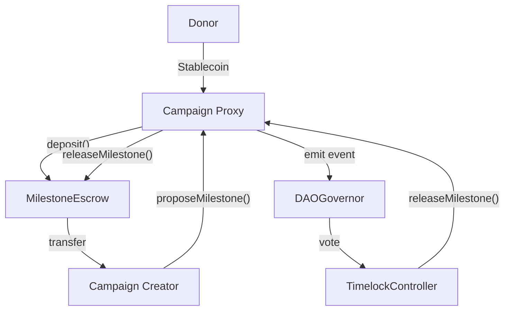

# Decentralized Autonomous Organization (DAO) for Fundraising

A robust, transparent, and milestone-driven fundraising ecosystem governed by a Decentralized Autonomous Organization (DAO). This platform ensures accountability by releasing funds to campaign creators only after milestones are verified and approved by token holders.

---

## 🏗 System Architecture

The system follows a modular architecture separating campaign logic, fund custody, and governance.



### Core Components

1.  **Campaign Management**: Logic for creating and managing individual charity projects.
2.  **Escrow & Custody**: Secure holding of donated funds with programmatic release.
3.  **Governance (DAO)**: Transparent decision-making process for milestone approvals.
4.  **Tokenomics**: Governance tokens representing voting power in the ecosystem.

---

## 📜 Detailed Contract Specifications

### 1. `Campaign.sol`

The primary interface for donors and creators. It acts as a gateway to the `MilestoneEscrow`.

- **Design Pattern**: Initializable (Logic used by `CampaignFactory` via `Clones`).
- **State Variables**:
  - `creator`: The address of the individual/organization running the campaign.
  - `governor`: The address of the `DAOGovernor` contract.
  - `stablecoin`: The IERC20 token used for donations (e.g., USDC).
  - `isLive`: Boolean flag indicating if the campaign is active.
  - `escrow`: Reference to the dedicated `MilestoneEscrow` for this campaign.
- **Key Functions**:
  - `donate(uint256 amount)`: Transfers stablecoins from donor to this contract, then immediately deposits them into `escrow`.
  - `proposeMilestone(string proofCid, uint amount)`: Allows creators to request funds by providing a proof (IPFS hash).
  - `approveAndGoLive()`: Activation function called by the `Timelock` after initial DAO approval.

### 2. `MilestoneEscrow.sol`

A security-first vault that holds funds for a specific campaign.

- **Security**: Inherits `ReentrancyGuard` and `Ownable`.
- **Logic**:
  - Funds are locked upon deposit.
  - `releaseMilestone(uint256 id)`: Only callable by the `Campaign` (which is authorized by the `Timelock`).
  - `emergencyWithdraw(uint256 amount)`: Safety hatch for the Governor to recover funds if a campaign is fraudulent.
- **Events**: `Deposited`, `MilestoneProposed`, `MilestoneReleased`.

### 3. `CampaignFactory.sol`

A gas-efficient factory for deploying campaigns.

- **Mechanism**: Uses `EIP-1167` Minimal Proxy (Clones) to deploy new campaigns for a fraction of the gas cost of a full contract deployment.
- **Functionality**: Stores the `IMPLEMENTATION` address and handles the initialization of new proxies in a single transaction.

### 4. `DAOGovernor.sol`

The brain of the platform, built on OpenZeppelin's modular Governor system.

- **Voting Logic**:
  - `Voting Delay`: 1 Day (time between proposal and voting start).
  - `Voting Period`: 1 Week (duration of the vote).
  - `Quorum`: 4% of total supply.
  - `Proposal Threshold`: 0 (any holder can propose; adjustable for production).
- **Modules**: `GovernorSettings`, `GovernorCountingSimple`, `GovernorVotes`, `GovernorVotesQuorumFraction`, `GovernorTimelockControl`.

### 5. `GovernanceToken.sol`

An ERC20 token that tracks voting power.

- **Features**:
  - `ERC20Votes`: Enables snapshotting of balances for fair voting without "flash loan" attacks.
  - `ERC20Wrapper`: Can wrap an underlying token (like USDC or a platform token) to grant voting power.
  - `ERC20Permit`: Allows for gasless delegation/voting via signatures.

---

## 🔄 Platform Workflow

### Phase 1: Campaign Creation

1.  A creator calls `CampaignFactory.createCampaign()`.
2.  A new `Campaign` proxy and a `MilestoneEscrow` are deployed.
3.  The campaign is initially "Paused" (not live).

### Phase 2: Fundraising

1.  The DAO votes to "Approve" the campaign.
2.  Once live, Donors call `Campaign.donate()`.
3.  Stablecoins are held in the `MilestoneEscrow`.

### Phase 3: Milestone Release

1.  Creator completes a goal and calls `Campaign.proposeMilestone()` with proof.
2.  A proposal is created in `DAOGovernor`.
3.  Governance token holders vote on the validity of the proof.
4.  If passed, the `Timelock` executes `Campaign.releaseMilestone()`.
5.  `MilestoneEscrow` transfers the specific amount to the Creator.

---

## 🛠 Development & Testing

### Installation

```bash
# Clone and install dependencies
git clone <repo>
forge install
```

### Testing Strategy

The project uses `forge` for comprehensive unit and integration testing.

```bash
# Run all tests
forge test -vvv

# Run specific test file
forge test --match-path test/CampaignTest.t.sol
```

### Deployment Configuration

The `script/Deploy.s.sol` script handles the complex setup:

1.  Deploys `MockUSDC`.
2.  Deploys and initializes `GovernanceToken`.
3.  Sets up `TimelockController` with appropriate roles.
4.  Deploys the `DAOGovernor`.
5.  Links the `CampaignFactory` to the Governor and Timelock.

---

## 🔒 Security Measures

- **Access Control**: Critical functions are protected by `onlyGovernor` (via Timelock) or `onlyOwner`.
- **Pull over Push**: Funds are never "pushed" to creators; they must be approved and then released.
- **Minimal Proxy**: Reduces the attack surface by reusing a single, audited implementation.
- **Stablecoin Standard**: Integrated with `SafeERC20` to handle non-standard ERC20 implementations.
